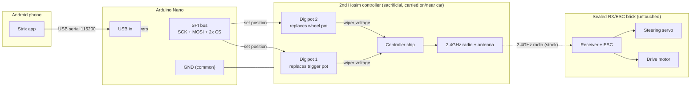

# Controller Takeover (Sealed ESC Workaround)

How to make the car drive itself when the ESC is a **sealed, resin-potted
receiver + ESC combo** — one you can't wire a signal into because its only
control input is a 2.4GHz radio link, and you can't open it to tap anything.

This is the situation on Hosim (and similar) waterproof cars: the motor speed
controller and the radio receiver are one waterproof brick, the steering servo
plugs into that brick, and the only way in is over the air from the car's own
handheld controller.

> **New to this? Read [`hardware-wiring.md`](hardware-wiring.md) first.** That doc
> covers the "normal" case where the ESC has a signal wire you connect straight
> to the Nano. This doc is the workaround for when it *doesn't*.

## Why not just emulate the radio?

Tempting idea: put a small radio on the car that impersonates the handheld
controller. In practice this is the hardest possible path. Teardowns of Hosim
gear show the link is a **proprietary, frequency-hopping FSK protocol** across
several 2.4GHz channels, with a pairing/sync handshake, running on an obscure
undocumented RF chip. There's no public spec and no off-the-shelf module that
speaks it. Reverse-engineering it would be an SDR-and-logic-analyzer project with
a real chance of never working.

So we don't touch the radio. Instead:

## The approach: automate a second controller

The handheld controller already speaks the exact radio language the ESC trusts,
and it's already paired. Its trigger and steering wheel are **potentiometers** —
variable resistors the controller's chip reads as "how far is the trigger
pulled" and "how far is the wheel turned."

So we let the **Arduino Nano replace the human hand**: it electronically moves
those two pots via **digital potentiometers**, and the controller transmits the
result over its normal radio link. The sealed ESC never knows the difference.

Because we're sacrificing a controller to this (its pots get replaced), **buy a
second controller** and keep your original intact for manual driving. See
[Buying a matching controller](#buying-a-matching-controller) below.

### What stays the same

Nothing changes on the phone or in the app. The Nano still speaks the exact same
serial protocol (`A:1`, `T1:<v>`, `T2:<v>`, `?`) documented in
`MotorController.kt`. Only the Nano *firmware* changes: where it used to write a
servo pulse to a pin, it now sets a digital-pot position. The 500 ms failsafe
still works — it just parks both pots at neutral (trigger released, wheel
centered) instead of neutralizing a servo output.

## The big picture



The chain is: **phone → Nano → digipots → controller chip → stock radio →
sealed ESC → motor + steering servo.** Two separate battery worlds again — the
phone powers the Nano, the controller runs on its own AA cells — meeting only at
a shared ground.

## How a digital pot replaces a mechanical pot

A mechanical potentiometer has three terminals:

```
  [HIGH] ---/\/\/\/\--- [LOW]
                |
             [WIPER]  <- voltage here depends on knob position; the chip reads this
```

- **HIGH** and **LOW** are the two ends of the resistive track (one goes to the
  controller's small supply rail, the other to ground).
- **WIPER** is the moving tap. Its voltage slides between HIGH and LOW as you
  move the trigger/wheel. The controller chip reads this voltage.

A **digital potentiometer** (e.g., MCP41010) has the same three analog terminals
(often labelled PA / PW / PB) plus a few digital pins the Nano drives over SPI.
You wire it in place of the mechanical pot — HIGH→PA, WIPER→PW, LOW→PB — and the
Nano sets the wiper position (0–255) in software. Electrically it's identical to
someone turning the knob.

The big advantage: the digipot divides the controller's **own** supply rail, so
the wiper voltage tracks exactly what the controller expects — you don't have to
know or match its precise voltage.

## Bill of materials

| Qty | Part | Notes |
|---|---|---|
| 1 | **Second Hosim controller** matching your car | Sacrificial. Keep the original for manual driving. See below. |
| 2 | **Digital potentiometer**, SPI, matched to the controller's pot value | e.g., MCP41010 (10k). Match the resistance to the controller's pots and pick a part rated **above** the controller's supply voltage. |
| 1 | Arduino Nano | You already have this. |
| — | Hookup wire, header, solder | To tap into the controller board and wire SPI. |
| 1 (optional) | Analog mux (74HC4053) per channel | Only if you want to keep manual control *on the sacrificed controller* too — usually unnecessary since the original stays intact. |

> ⚠️ **Digipot voltage rating.** Common digipots (MCP41xxx) top out around 5.5V.
> If the controller runs on 4×AA (6V) that's over spec — either pick a
> higher-voltage digipot or run that controller from a regulated 4.5–5V source.
> Measure the controller's rail before buying (step 3 under "Before you build").

## Nano pin usage

SPI on the Nano (Uno/Nano pinout):

| Signal | Nano pin | Goes to |
|---|---|---|
| SCK (clock) | **D13** | Both digipots' SCK |
| MOSI (data) | **D11** | Both digipots' SI/data |
| CS — throttle | **D7** | Digipot 1 chip-select |
| CS — steering | **D8** | Digipot 2 chip-select |
| GND | **GND** | Common ground with the controller |

Two digipots share SCK and MOSI; each gets its own chip-select (CS) so the Nano
can address them independently. (These pins are a starting suggestion — any two
free digital pins work for the CS lines.)

> **Common ground is mandatory.** The Nano's GND must connect to the controller's
> ground. Without it, the wiper voltages the digipots produce are meaningless to
> the controller chip.

## Before you build — open the controller and confirm

1. **Confirm the trigger and wheel are potentiometers** (3 terminals, wiper
   voltage sweeps smoothly), not on/off switches. If they're switches, this
   approach only gives full-on/full-off; consider swapping the ESC instead
   (see `hardware-wiring.md`).
2. **Identify each pot's three terminals** with a multimeter: HIGH (sits at the
   rail voltage), LOW (0V/ground), WIPER (sweeps between the two as you move the
   control).
3. **Measure the controller's supply rail** (usually 3×AA = 4.5V). This sets the
   digipot's required voltage rating.
4. **Note the pot resistance** (measure end-to-end: HIGH to LOW) so you can match
   the digipot value (10k is typical).

## Firmware changes (Nano)

A ready-to-flash variant lives at
**`arduino/ControllerTakeover/ControllerTakeover.ino`** —
open it, fill in the calibration constants (next section), and upload. The
command parsing (`A:`, `T1:`, `T2:`, `?`) is byte-for-byte identical to
`arduino/EscServoController/EscServoController.ino`; only the *output*
changes: instead of `Servo.writeMicroseconds()`, it sets a digipot wiper. The
relevant pieces:

```cpp
#include <SPI.h>

const int CS_THROTTLE = 7;   // digipot 1 (replaces the trigger pot)
const int CS_STEERING = 8;   // digipot 2 (replaces the wheel pot)

// ---- CALIBRATION (measure these on your controller — see below) ----
// Wiper values (0-255) that make the controller output each extreme.
const int THR_MIN = 20,  THR_NEUTRAL = 128, THR_MAX = 235;  // reverse / stop / forward
const int STR_LEFT = 20, STR_CENTER  = 128, STR_RIGHT = 235; // left / center / right

void setWiper(int csPin, int value) {
  value = constrain(value, 0, 255);
  digitalWrite(csPin, LOW);
  SPI.transfer(0x11);        // MCP41xxx command: write data to pot 0
  SPI.transfer(value);
  digitalWrite(csPin, HIGH);
}

// Map app throttle (-100..100) onto the calibrated wiper range, split at neutral.
int throttleToWiper(int v) {
  return (v >= 0) ? map(v, 0, 100, THR_NEUTRAL, THR_MAX)
                  : map(v, -100, 0, THR_MIN, THR_NEUTRAL);
}
int steeringToWiper(int v) {
  return (v >= 0) ? map(v, 0, 100, STR_CENTER, STR_RIGHT)
                  : map(v, -100, 0, STR_LEFT, STR_CENTER);
}

void setNeutral() {
  setWiper(CS_THROTTLE, THR_NEUTRAL);
  setWiper(CS_STEERING, STR_CENTER);
}

void setup() {
  Serial.begin(115200);
  pinMode(CS_THROTTLE, OUTPUT); digitalWrite(CS_THROTTLE, HIGH);
  pinMode(CS_STEERING, OUTPUT); digitalWrite(CS_STEERING, HIGH);
  SPI.begin();
  setNeutral();
}
```

Then in the command handler, replace the servo writes:

```cpp
// T1 = throttle (drive), T2 = steering — same protocol as before.
if (channel == 1) setWiper(CS_THROTTLE, throttleToWiper(val));
if (channel == 2) setWiper(CS_STEERING, steeringToWiper(val));
```

- **Arm/disarm** and the **500 ms failsafe** call `setNeutral()` instead of
  writing neutral servo pulses — same safety behavior, new output layer.
- Channel 3 is unused in this setup.

## Calibration procedure

> **Fill-in worksheet:** [`controller-takeover-calibration.md`](controller-takeover-calibration.md)
> walks these steps with blanks for every measured value and a checkbox per step.

Because the digipot range rarely maps 1:1 to the controller's full stick travel,
calibrate once with the **wheels off the ground** and the car powered/paired:

1. Load firmware with rough values (start with the constants above).
2. Send `A:1` then `T1:0` — the car should sit still. If it creeps, adjust
   `THR_NEUTRAL` up/down until it's dead stopped. This is the most important one.
3. Send `T1:100` and `T1:-100`; adjust `THR_MAX` / `THR_MIN` so full throttle
   matches the fastest you want (you don't have to use the pot's full range).
4. Repeat for steering: `T2:0` centers the wheels (tune `STR_CENTER`), then
   `T2:-100` / `T2:100` for full left/right lock (`STR_LEFT` / `STR_RIGHT`).
5. Re-flash with the tuned constants.

## Step-by-step build

Do all first tests with the **car's wheels off the ground**.

1. **Pair the controller to the car** using its normal bind procedure, and make
   sure it drives the car manually first. Don't modify anything until that works.
2. **Power off**, open the controller, and locate the trigger and wheel pots.
3. **Desolder/replace each pot with a digipot**: controller HIGH→PA, WIPER→PW,
   LOW→PB. Power the digipot's VDD/VSS from the controller's rail and ground
   (keeping it within the digipot's voltage rating).
4. **Wire SPI** from the Nano: SCK→D13, MOSI→D11, and each digipot's CS to D7/D8.
5. **Tie grounds together** — Nano GND to the controller ground.
6. **Load the new firmware** and run the calibration procedure above.
7. **Mount the controller board on/near the car.** Range is irrelevant at inches;
   just keep the antenna clear of metal and the motor.

## First drive test

With the wheels still off the ground and the car paired:

```
A:1        arm
T1:0       throttle neutral (car should not move)
T2:0       steering centered
T2:-100    wheels full left
T2:100     wheels full right
T2:0       recenter
T1:30      30% forward
T1:-30     30% reverse
A:0        disarm (parks both pots at neutral)
```

Confirm the steering sweeps and the wheels spin the right way before putting the
car on the ground.

## Troubleshooting

| Symptom | Likely cause / fix |
|---|---|
| Controller no longer drives the car at all | Not paired, or a digipot terminal is miswired. Verify manual behavior before/after each change; re-run the bind procedure. |
| Car creeps at `T1:0` | `THR_NEUTRAL` is off — nudge it until the car is dead stopped. |
| Throttle/steering reversed | Swap `..._MIN`/`..._MAX` (or `LEFT`/`RIGHT`) in the calibration constants. |
| Only full-on or full-off, no in-between | The controls may be switches, not pots — this approach can't add proportionality; swap the ESC instead. |
| Erratic/jumpy values | Missing common ground between Nano and controller, or digipot powered above its voltage rating. |
| Digipot runs hot / dies | Over-voltage — controller rail exceeds the digipot's max (see the BOM warning). |
| Car keeps moving after app disconnects | Failsafe not wired to `setNeutral()` — verify the 500 ms timeout path. |

## Buying a matching controller

Hosim controllers are **model-specific and must bind to your car's receiver**, so
match the controller to your car's model number (printed on the car, the box, or
the receiver label). The two official Hosim replacement transmitters:

- **[Hosim F12025 transmitter](https://www.amazon.com/Hosim-Transmitter-Assembly-Parts-F12025/dp/B09ZHT5TLF)**
  — **the match for this build.** Listed for **M13, M23, X27, X25, X17, X16, X08,
  X07, X15, X07W, and X15W**, and confirmed visually identical to the X15W's stock
  controller. This is the one to buy for a Hosim X15W.
- **[Hosim 25-ZJ08 transmitter](https://www.amazon.com/Transmitter-Assembly-Accessory-25-ZJ08-Hosim/dp/B07BWCRTS2)**
  — the older **9125, 9155, 9156, Q903** family. Listed only for reference; **not**
  for the X15W.

> **Match the controller to your car's model.** The X15W uses the F12025 above.
> For a different Hosim, buy the transmitter whose listing names your model —
> the wrong family won't bind to your receiver.

**Pairing note:** these systems bind one controller to the receiver via a
power-up sequence. Keep your **original controller for manual driving** and the
**second (modified) one for autonomous mode** — to switch, re-run the bind
procedure with whichever controller you want active. Confirm your specific
model's bind steps in its manual.

## Reference

- The "normal" wired-ESC guide: [`hardware-wiring.md`](hardware-wiring.md)
- Calibration worksheet: [`controller-takeover-calibration.md`](controller-takeover-calibration.md)
- Ready-to-flash firmware: `arduino/ControllerTakeover/ControllerTakeover.ino`
- Original servo/ESC firmware: `arduino/EscServoController/EscServoController.ino`
- App-side serial protocol (unchanged): `app/.../MotorController.kt`
- Action → throttle/steering mapping: `app/.../DriveCommand.kt`
