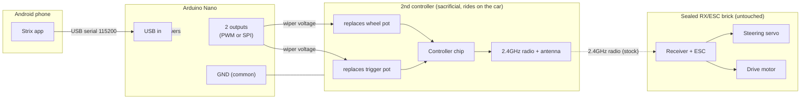

# Path B: Controller Takeover

> For cars whose ESC is a **sealed receiver+ESC brick** with no signal input.
> Instead of wiring the car, the Nano impersonates the controls of a spare
> handheld controller — and the car's own radio does the rest.

[← Hardware guide](hardware-wiring.md) · [Glossary](glossary.md) · [Parts](parts-and-shopping.md#path-b-controller-takeover) · [Serial protocol](serial-protocol.md)

---

## At a glance

|                    |                                                                                                                                                             |
| ------------------ | ----------------------------------------------------------------------------------------------------------------------------------------------------------- |
| **What you'll do** | Replace a spare controller's trigger and steering pots with something the Nano drives                                                                       |
| **You'll need**    | A second matching controller, a [multimeter](parts-and-shopping.md#tools), and either 2 resistors + 2 capacitors (Variant B) or 2 digipot chips (Variant A) |
| **Time**           | An evening, plus calibration                                                                                                                                |
| **Difficulty**     | Moderate — some soldering, one bench measurement session                                                                                                    |
| **Companion docs** | [Identify the pots](pot-identification.md) · [Calibration worksheet](controller-takeover-calibration.md)                                                    |

### The build in five steps

1. [Buy and bind a second controller](parts-and-shopping.md#the-controller-required-for-path-b), confirm it drives the car manually.
2. [Identify its pot wires](pot-identification.md) with a multimeter.
3. [Pick a variant](#pick-a-variant-digipots-or-pwm) — PWM (recommended) or digipots.
4. [Wire it up](#step-by-step-build) and flash the firmware.
5. [Calibrate](#calibration-procedure) with the wheels off the ground.

---

## The problem

On waterproof and "all-terrain" cars, the motor speed controller and the radio
receiver are one resin-potted brick. The steering servo plugs into that brick,
and the only way in is over the air from the car's handheld controller. There's
no signal wire to tap and no way to open it non-destructively.

<a id="why-not-just-emulate-the-radio"></a>

<details>
<summary><strong>Why not just emulate the radio?</strong> (the tempting path that doesn't work)</summary>

Putting a small radio on the car to impersonate the handheld controller sounds
elegant and is the hardest possible approach. Teardowns of this class of gear
show the link is a **proprietary, frequency-hopping ([FHSS](glossary.md#fhss))
protocol** across several 2.4 GHz channels, with a pairing handshake, running on
an obscure undocumented RF chip. There's no public spec and no off-the-shelf
module that speaks it. Reverse-engineering it is an SDR-and-logic-analyzer
project with a real chance of never working.

So we don't touch the radio at all.

</details>

---

## The approach: automate a second controller

The handheld controller already speaks the exact radio language the ESC trusts,
and it's already bound to the car. Its trigger and steering wheel are just
[potentiometers](glossary.md#potentiometer-pot) — and a pot is something we can
replace electronically.


```mermaid
flowchart LR
    subgraph phone["Android phone"]
        app["Strix app"]
    end

    subgraph nano["Arduino Nano"]
        usb["USB in"]
        out["2 outputs<br/>(PWM or SPI)"]
        gnd["GND (common)"]
    end

    subgraph ctrl["2nd controller (sacrificial, rides on the car)"]
        rt["replaces trigger pot"]
        rs["replaces wheel pot"]
        mcu["Controller chip"]
        rf["2.4GHz radio + antenna"]
    end

    subgraph sealed["Sealed RX/ESC brick (untouched)"]
        rx["Receiver + ESC"]
        motor["Drive motor"]
        servo["Steering servo"]
    end

    app -->|"USB serial 115200"| usb
    usb -. powers .-> nano
    out -->|"wiper voltage"| rt
    out -->|"wiper voltage"| rs
    rt --> mcu
    rs --> mcu
    mcu --> rf
    rf -. "2.4GHz radio (stock)" .-> rx
    rx --> motor
    rx --> servo
    gnd --- ctrl
```

The chain: **phone → Nano → the controller's pot inputs → controller chip →
stock radio → sealed ESC → motor + steering.** Two battery worlds again — the
phone powers the Nano, the controller runs on its own AAs — meeting only at a
[shared ground](glossary.md#common-ground).

Because the modification sacrifices a controller, **buy a second one** and keep
your original for manual driving.
→ [Which controller to buy](parts-and-shopping.md#the-controller-required-for-path-b)

> ✅ **Nothing changes on the phone.** The Nano speaks the identical
> [serial protocol](serial-protocol.md) — `A:1`, `T1:<v>`, `T2:<v>`, `?` — and
> the 500 ms failsafe still parks everything at neutral. Only the firmware's
> output layer differs.

---

## How a digital pot replaces a mechanical pot

A pot is three terminals: a resistive [track](glossary.md#track) between HIGH and
LOW, and a [wiper](glossary.md#wiper) that slides along it.

```
  [HIGH] ───/\/\/\/\/\/\─── [LOW]
                  │
               [WIPER]  ← the chip reads the voltage here
```

A [digipot](glossary.md#digipot) (e.g. MCP41010) has the same three analog
terminals plus digital pins the Nano drives. Wire it in place of the mechanical
pot, set the wiper position in software, and electrically it's identical to
someone turning the knob. Because it divides the controller's _own_ supply rail,
the wiper voltage automatically matches what the controller expects.

**But notice what that picture actually says:** the controller chip doesn't sense
resistance. It senses the **voltage** at the wiper — a
[voltage divider](glossary.md#voltage-divider) output. That opens a second, cheaper
door.

> 💡 **Why you can't skip the middleman.** A Nano [GPIO](glossary.md#gpio) pin is
> a switch, not a resistor: it can output high, low, or nothing, but it cannot
> present "3.2 kΩ" to anything. Wiring pot wires straight to Nano pins can't
> work. Producing the right _voltage_, though, a Nano can absolutely do.

---

## Pick a variant: digipots or PWM

Two ways to fake a pot, both with ready-to-flash firmware:

|                                                        | **Variant A: digipots**                                                          | **Variant B: PWM synthesis**                                                              |
| ------------------------------------------------------ | -------------------------------------------------------------------------------- | ----------------------------------------------------------------------------------------- |
| Extra parts                                            | 2× digipot chip                                                                  | 4 resistors + 4 capacitors                                                                |
| Cost                                                   | ~$24 on Amazon, or ~$4 + distributor shipping                                    | ~$10, or free from a parts drawer                                                         |
| Forward-throttle steps _(this build's trigger window)_ | ~80                                                                              | **~290**                                                                                  |
| …with top speed capped to ⅓                            | ~27                                                                              | **~95**                                                                                   |
| Output ripple                                          | None, by construction                                                            | Needs two cascaded RC stages                                                              |
| Tracks the controller's sagging AA rail                | Inherently                                                                       | Needs a rail-sense subsystem in firmware                                                  |
| If the Nano stops driving                              | Wiper holds its last position                                                    | Node decays to 0 V, **past full throttle**                                                |
| Wiring complexity                                      | SPI, 5 wires, chip powered from the controller                                   | 4 filter stages, 4 wires, nothing powered                                                 |
| Firmware                                               | [`ControllerTakeover.ino`](../arduino/ControllerTakeover/ControllerTakeover.ino) | [`ControllerTakeoverPwm.ino`](../arduino/ControllerTakeoverPwm/ControllerTakeoverPwm.ino) |

**Resolution is real, and it was the wrong thing to optimise.** The step counts
above are correct: software-capping top speed squeezes the app's whole −100…100
range into a slice of the physical window, and the granularity you lose is at the
_bottom_ end where creep speeds and obstacle approach live. All true — and it
stopped mattering the moment this build hit the bench, because **PWM's noise floor
swamped the resolution it was chosen for.** Ripple and rail-sense jitter moved the
output by tens of millivolts, far more than the ~1 mV that Variant B's extra steps
are worth. Winning a resolution argument by 3× while giving up an order of
magnitude in stability is a bad trade, and this table now shows the three rows
that carry it: ripple, rail sensing, and the un-driven failure mode.

Two of those became work. Clean output needed a **two-stage** filter, not the
single RC first drawn here. Rail tracking needed oversampling, averaging and a
validity check — and the arithmetic bug in that subsystem is what threw a live car
to full throttle. A digipot needs none of it: it divides the controller's own rail
inherently and holds position when the Nano goes quiet.

> **If you are building this fresh, buy the digipots.** Variant B is documented,
> working and cheap, and it is what _this_ car runs — the passives are already
> soldered and it's two components from finished. But it is the harder path, and
> the honest reason it was chosen was resolution, which turned out not to be the
> binding constraint. See the [bring-up log](controller-takeover-bringup.md) for
> the measurements behind that conclusion.

<details>
<summary><strong>Why the cheap X9C103S isn't offered as a variant</strong></summary>

At ~$12 for four, the X9C103S is tempting. Three strikes for a fast car:

1. **100 [taps](glossary.md#taps-wiper-codes)** across the full track → ~31
   forward steps here, and only ~10 under a ⅓ speed cap. Noticeably chunky
   exactly where fine control matters.
2. **Open-loop interface.** It's positioned by counting up/down pulses with no
   position readback, so a single missed pulse becomes a _persistent_ throttle
   offset until you re-home it.
3. **Non-volatile recall** adds startup states to reason about.

On a 2 kg object capable of 60 km/h, "throttle offset that persists" is not a fun
failure class. Fine for a slow car; poor for this one.

</details>

**This build uses Variant B** — no special chips, and the passives cost less than
shipping on the alternatives. It works, and the rest of this page documents it as
built. Read the caveat above first if you still have the choice.

---

## Variant B: PWM wiper synthesis (no digipots)

Drive the **wiper wire alone** with [PWM](glossary.md#pwm) smoothed by an
[RC low-pass filter](glossary.md#rc-low-pass-filter), and the controller chip
sees exactly the voltage a pot would have produced. With connector-terminated
pots, the whole job is the pot connectors' wires onto the Nano plus four passive
parts — the controller board is never touched.

### Wiring

| Controller wire (board-side pot connector)     | Nano connection               | Why                                                   |
| ---------------------------------------------- | ----------------------------- | ----------------------------------------------------- |
| Trigger **WIPER**                              | **D9**, through an RC filter  | The voltage the chip reads for throttle               |
| Wheel **WIPER**                                | **D10**, through an RC filter | Same, for steering                                    |
| **HIGH** / rail (either pot's — they share it) | **A0**                        | [Rail sensing](#why-the-rail-sense-wire-matters)      |
| **LOW** / ground                               | **GND**                       | [Common ground](glossary.md#common-ground), mandatory |

Don't know which wire is which? → **[Identify the pots](pot-identification.md)**

```
  Nano D9 ──[ 1k ]──┬──[ 1k ]──┬── trigger WIPER (board-side connector)
                    │          │
                 [2.2µF]    [2.2µF]
                    │          │
                   GND        GND

  Nano D10 ─── same two-stage filter ─── wheel WIPER
  Controller rail ────────────────────── A0
  Controller ground ──────────────────── GND
```

> 📐 **Prefer a picture?** [`docs/diagrams/`](diagrams/README.md) holds a
> Fritzing breadboard diagram of exactly this circuit — the Nano's rotation,
> both filters, the rails, and labelled wire ends for each controller
> connection.

### Use two stages, not one

An earlier version of this page said the values were uncritical — "R 1–10 kΩ,
C 0.5–10 µF, bigger C is smoother." **That is wrong, and a single stage anywhere
in that range makes the steering servo hunt.**

A control experiment found it: plug the original pot back in and the servo sits
perfectly still; swap our emulator back in and it oscillates gently. The PWM duty
was measured bit-identical across 18 consecutive samples, so nothing electrical
was moving on the Nano's pin. The difference is that **a mechanical pot has zero
ripple** and an RC-filtered PWM does not. 4.7 kΩ + 1 µF leaves about **14 mV** of
15.6 kHz residue. Tiny — but it's _coherent_, and when the controller's ADC
undersamples a periodic signal the sampled value beats slowly. The servo then
faithfully follows the beat.

The trap is that **R × C alone doesn't tell you the ripple.** Two filters with
the same product have the same ripple _and_ the same settling time, so trading R
against C buys nothing here:

| Filter                        | Ripple                  | Settling  | Output impedance |
| ----------------------------- | ----------------------- | --------- | ---------------- |
| 4.7 kΩ + 1 µF, one stage      | 14.2 mV                 | 24 ms     | 4.7 kΩ           |
| 1 kΩ + 4.7 µF, one stage      | **14.2 mV** — identical | 24 ms     | 1 kΩ             |
| 4.7 kΩ + 10 µF, one stage     | 1.4 mV                  | 235 ms    | 4.7 kΩ           |
| **1 kΩ + 2.2 µF, two stages** | **0.14 mV**             | **11 ms** | **1 kΩ**         |
| 1 kΩ + 4.7 µF, two stages     | 0.03 mV                 | 24 ms     | 1 kΩ             |

Cascading two stages attenuates by the _square_, so ripple falls ~100× while the
response actually gets **faster** than the original single stage. The 1 kΩ output
impedance is a bonus: the pot it replaces presented at most ~1.3 kΩ (R/4 at
midpoint), so this lands where the controller expects rather than 3.6× stiffer.

Verified by ear and by hand on this build: 1 µF → 10 µF on one channel cut the
wobble noticeably, confirming ripple as the cause before committing to the
rebuild.

→ [Parts and salvage options](parts-and-shopping.md#variant-b-pwm-wiper-synthesis--recommended)

> ⚠️ **D9 and D10 are not arbitrary.** They're the Nano's
> [Timer1](glossary.md#timer1) pins — the only 16-bit timer — and the firmware
> reconfigures it for 10-bit duty at 15.6 kHz. At that frequency even a low
> filter corner leaves millivolt ripple. Moving these outputs to other pins
> silently costs you most of your resolution.

### Why the rail-sense wire matters

A mechanical pot divides the controller's own battery rail. When its AAs sag from
4.5V to 4.0V, every voltage scales together and the chip — which reads
[ratiometrically](glossary.md#ratiometric) against that same rail — never
notices.

A fixed Nano voltage would _not_ scale. Your calibrated neutral would drift as
the batteries drain, and on a throttle, drifting neutral means a **creeping car.**

So the firmware reads the rail on A0 and scales every duty by it:

```
duty = calibration_value × analogRead(A0) / 1023
```

The Nano's own supply voltage cancels out of that math exactly, so it's correct
without any reference calibration. Bonus: since duty can never exceed the
measured rail, the output physically cannot be driven above the controller chip's
supply.

### Calibration units

Variant B constants are **rail fractions in 1/1023 units** (0 = controller
ground, 1023 = controller rail), not the digipot's 0–255 codes. The placeholders
in the sketch are pre-seeded from this build's
[measured pot windows](pot-identification.md#field-data-from-this-build). The
[calibration procedure](#calibration-procedure) is otherwise identical.

### Failure mode to bench-test

If the Nano loses power, the wiper wires float and decay toward 0V — _below_ the
trigger's normal [travel window](glossary.md#travel-window). Before any
unattended use, find out what the controller transmits in that state: wheels off
the ground, drive, unplug the Nano mid-command, watch.

> Variant A has the mirror-image quirk — a digipot holds its last commanded value
> instead. Neither is inherently safer. Know which one you've got.

---

## Variant A: digipot chips

The alternative: real digipots as drop-in electrical twins.
→ [Which chips to buy](parts-and-shopping.md#variant-a-digipot-chips--alternative)

### Variant A: Nano pin usage (SPI)

| Signal        | Nano pin | Goes to                           |
| ------------- | -------- | --------------------------------- |
| SCK (clock)   | **D13**  | Both digipots' SCK                |
| MOSI (data)   | **D11**  | Both digipots' SI/data            |
| CS — throttle | **D7**   | Digipot 1 chip-select             |
| CS — steering | **D8**   | Digipot 2 chip-select             |
| GND           | **GND**  | Common ground with the controller |

Both chips share clock and data; each gets its own chip-select so the Nano can
address them independently. Any two free digital pins work for the CS lines.

### Variant A: digipot pin-by-pin (MCP41010)

The thing that trips people up: **the controller's pots never wire to the Nano.**
The mechanical pots come out, the digipots take their place, and each digipot
straddles two worlds — its _digital_ side (CS, SCK, SI) driven by the Nano, its
_analog_ side (PA0/PW0/PB0) landing where the pot was, powered by the
controller's own rail. The Nano's 5V never enters the controller.

For the 8-pin DIP package, both chips wire identically except CS:

| Pin | Name | Wire to                                    | Notes                                                       |
| --- | ---- | ------------------------------------------ | ----------------------------------------------------------- |
| 1   | CS   | Nano **D7** (throttle) / **D8** (steering) | The only pin that differs between the two chips             |
| 2   | SCK  | Nano **D13**                               | Shared                                                      |
| 3   | SI   | Nano **D11**                               | Shared                                                      |
| 4   | VSS  | Controller **ground**                      | Ties into the common ground                                 |
| 5   | PB0  | Pot **LOW** node                           | Where the old pot's ground-side terminal sat                |
| 6   | PW0  | Pot **WIPER** node                         | What the controller chip reads                              |
| 7   | PA0  | Pot **HIGH** node                          | The controller's supply-rail side                           |
| 8   | VDD  | Controller **supply rail** (~4.5V)         | **Never** the Nano's 5V; must stay within the chip's rating |

> ⚠️ **Voltage rating.** MCP41xxx parts top out around 5.5V. If the controller
> runs on 4×AA (6V), that's over spec — pick a higher-voltage part or feed that
> controller from a regulated 4.5–5V source. Measure the rail first, during
> [pot identification](pot-identification.md#step-3-find-high-and-low-powered-test).

---

## Firmware

Ready-to-flash sketches for both variants:

| Variant      | Sketch                                                                                    | Calibration units     |
| ------------ | ----------------------------------------------------------------------------------------- | --------------------- |
| A — digipots | [`ControllerTakeover.ino`](../arduino/ControllerTakeover/ControllerTakeover.ino)          | 0–255 wiper codes     |
| B — PWM      | [`ControllerTakeoverPwm.ino`](../arduino/ControllerTakeoverPwm/ControllerTakeoverPwm.ino) | 0–1023 rail fractions |

Open yours, fill in the calibration constants, and upload. Both parse commands
byte-for-byte identically to the Path A sketch — only the output layer differs.
Each sketch's header comment carries its full wiring map, and both support the
[distance sensors](sensor-wiring.md) unchanged.

Flashing needs the **VL53L4CD** library if you're building the sensor array:
Arduino IDE → Library Manager → "VL53L4CD", or `arduino-cli lib install VL53L4CD`.

---

## Step-by-step build

> ⚠️ Do every test with the **car's wheels off the ground.**

1. **Bind and verify manually.** Pair the second controller to the car using its
   normal bind procedure and drive it by hand. Don't modify anything until that
   works — otherwise you won't know whether a later failure is your wiring or the
   pairing.
2. **Power off** and open the controller. Locate the trigger and wheel pots.
3. **[Identify each pot's wires](pot-identification.md)** — WIPER, HIGH, LOW.
   Record them in the [worksheet](controller-takeover-calibration.md).
4. **Replace each pot**, per your variant:
   - **Variant B:** remove the pot. Its WIPER line takes the RC-filtered output
     from the Nano; one HIGH line taps the rail for sensing. Nothing else
     connects.
   - **Variant A:** digipot onto the pot's pads or connector — HIGH→PA0,
     WIPER→PW0, LOW→PB0 — with VDD/VSS from the controller's rail and ground.
5. **Wire the Nano side**, per your variant:
   - **Variant B:** D9 → filter → trigger wiper, D10 → filter → wheel wiper,
     rail → A0.
   - **Variant A:** SCK→D13, MOSI→D11, CS→D7 and D8.
6. **Tie the grounds together** — Nano GND to controller ground. Non-negotiable.
7. **Flash your variant's firmware** with placeholder constants.
8. **[Calibrate](#calibration-procedure)**, then re-flash with your measured
   values.
9. **Mount the controller board on or near the car.** Range is irrelevant at
   inches — just keep the antenna clear of metal and away from the motor.

---

## Calibration procedure

> **Use the [fill-in worksheet](controller-takeover-calibration.md)** — it walks
> these steps with a blank for every value and a checkbox per step.

Your output range rarely maps 1:1 onto the controller's stick travel, so
calibrate once with the **wheels off the ground** and the car powered and paired:

1. Flash with the placeholder constants.
2. Send `A:1` then `T1:0`. The car should sit **completely still.** If it creeps,
   adjust `THR_NEUTRAL` until it's dead stopped. **Do this one first** — it's the
   only constant whose error is dangerous rather than merely annoying.
3. Send `T1:100` and `T1:-100`; set `THR_MAX` / `THR_MIN` to the fastest you
   actually want. You do _not_ have to use the full range — clamping these is how
   you make a 60 km/h car usable indoors.
4. Repeat for steering: `T2:0` centers (tune `STR_CENTER`), then `T2:-100` /
   `T2:100` for full left/right lock (`STR_LEFT` / `STR_RIGHT`).
5. Re-flash with the tuned constants.

> 💡 If a direction comes out reversed, you have HIGH and LOW the wrong way
> round. Fix it in software rather than rewiring — but **replace every constant
> with `1023 − value`**, don't just swap MIN↔MAX. A swap leaves neutral wrong,
> because the travel windows aren't centred. See
> [what a HIGH/LOW mix-up actually costs](pot-identification.md#why-this-matters).

---

## First drive test

Wheels still off the ground, car paired. Full command reference:
[driving it by hand](serial-protocol.md#driving-it-by-hand).

```
A:1        arm
T1:0       throttle neutral — the car must not move
T2:0       steering centered
T2:-100    wheels full left
T2:100     wheels full right
T2:0       recenter
T1:30      30% forward
T1:-30     30% reverse
A:0        disarm (parks everything at neutral)
```

Then verify the safety layer:

- **Failsafe:** drive, then unplug the USB cable. The car stops within ~0.5s.
- **Variant B floating-wiper test:** drive, then cut power to the Nano. Note what
  the controller does — see [failure mode](#failure-mode-to-bench-test).

Once steering sweeps correctly and the wheels spin the right way, put the car on
the ground and start slow.

---

## Troubleshooting

| Symptom                                                     | Likely cause / fix                                                                                                                                                        |
| ----------------------------------------------------------- | ------------------------------------------------------------------------------------------------------------------------------------------------------------------------- |
| Controller no longer drives the car at all                  | Not bound, or a wiper line is miswired. Re-verify manual driving and re-run the bind procedure.                                                                           |
| Car creeps at `T1:0`                                        | `THR_NEUTRAL` is off. Nudge it until dead stopped.                                                                                                                        |
| Throttle or steering reversed                               | HIGH and LOW are swapped. Replace every constant with `1023 − value` — not a MIN/MAX swap, which leaves neutral wrong. [Details](pot-identification.md#why-this-matters). |
| Outputs all scaled wrong, or wander on their own            | Rail sense isn't connected. Send `R?`: a raw A0 value well under 500 that drifts means A0 is floating, and the firmware is running on a hard-coded rail guess.            |
| Only full-on or full-off, no in-between                     | The controls may be switches, not pots — this approach can't add proportionality. Consider swapping the ESC ([Path A](esc-wiring.md)).                                    |
| Erratic or jumpy behavior                                   | Missing [common ground](glossary.md#common-ground) between Nano and controller.                                                                                           |
| **(B)** Neutral drifts as the controller's batteries drain  | The A0 rail-sense wire isn't really on the controller rail, so the [ratiometric scaling](#why-the-rail-sense-wire-matters) is running on a stale default.                 |
| **(B)** Throttle surges or steps instead of moving smoothly | Filter capacitor missing, disconnected, or far too small — raw PWM is reaching the controller chip. Use ≥1 µF with the series R in place.                                 |
| **(A)** Digipot runs hot or dies                            | Over-voltage: the controller rail exceeds the chip's max. See the [rating warning](#variant-a-digipot-pin-by-pin-mcp41010).                                               |
| Car keeps moving after the app disconnects                  | The [failsafe](serial-protocol.md#the-500-ms-failsafe) path isn't reaching neutral — verify the 500 ms timeout in firmware.                                               |

---

## Reference

- [Identify the pots](pot-identification.md) — the bench procedure and this build's measurements
- [Calibration worksheet](controller-takeover-calibration.md) — fill-in checklist
- [Bring-up log](controller-takeover-bringup.md) — this build's measured values, and the findings that cost time
- [Parts & shopping](parts-and-shopping.md#path-b-controller-takeover) — controllers, chips, passives
- [Serial protocol](serial-protocol.md) — the command language, unchanged from Path A
- Firmware: [`ControllerTakeover.ino`](../arduino/ControllerTakeover/ControllerTakeover.ino) · [`ControllerTakeoverPwm.ino`](../arduino/ControllerTakeoverPwm/ControllerTakeoverPwm.ino)
- App side: [`MotorController.kt`](../app/src/main/java/com/resourcefork/rccontrol/MotorController.kt) · [`DriveCommand.kt`](../app/src/main/java/com/resourcefork/rccontrol/DriveCommand.kt)

---

**Next:** [Identify the pots](pot-identification.md) · **Then:** [Calibration worksheet](controller-takeover-calibration.md) · **Optional:** [add distance sensors](sensor-wiring.md)
