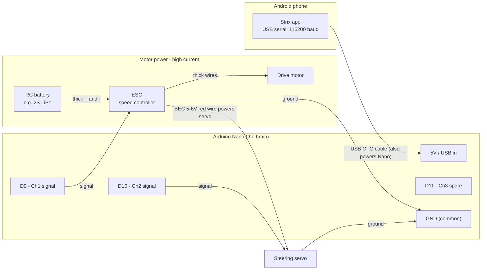

# Path A: ESC & Servo Wiring

> The direct drive path: wire a conventional **ESC** and **steering servo**
> straight to the Arduino Nano's signal pins.

[← Hardware guide](hardware-wiring.md) · [Glossary](glossary.md) · [Parts](parts-and-shopping.md#path-a-direct-wired-esc) · [Serial protocol](serial-protocol.md)

---

## At a glance

| | |
| --- | --- |
| **What you'll do** | Connect the ESC and steering servo signal wires to the Nano, sharing one ground |
| **You'll need** | Jumper wires. That's it — no extra components. |
| **Time** | 30 minutes, plus a bench test |
| **Difficulty** | Easy — no soldering required if your connectors are standard |
| **Prerequisite** | Your ESC has a servo-style signal wire. [Not sure?](hardware-wiring.md#step-1-pick-your-drive-path) |

> **Sealed receiver+ESC combo?** Waterproof cars often pot the receiver and ESC
> into one brick whose only input is its own 2.4 GHz radio. None of the drive
> wiring below applies — use **[Path B: controller takeover](controller-takeover.md)**
> instead.

New to the parts or acronyms? The [glossary](glossary.md) defines everything, and
the [hardware guide](hardware-wiring.md#what-youre-building) explains the one rule
that keeps the Nano alive.

---

## The pin map

Straight from [`EscServoController.ino`](../arduino/EscServoController/EscServoController.ino)
and [`MotorController.kt`](../app/src/main/java/com/resourcefork/rccontrol/MotorController.kt),
so it matches the firmware exactly.

| Nano pin | Channel | Wired to | App value range |
| --- | --- | --- | --- |
| **D9** | 1 | **ESC** signal wire (drive) | `-100` full reverse … `0` stop … `100` full forward |
| **D10** | 2 | **Steering servo** signal wire | `-100` full left … `0` center … `100` full right |
| **D11** | 3 | Spare / aux — unused by the car | `-100` … `100` |
| **GND** | — | Common ground for *everything* | — |

For a basic car you only need **D9**, **D10**, and **GND**. The app's
`drive(throttle, steering)` sends throttle to channel 1 and steering to channel 2.

---

## The big picture



**Two separate power worlds, meeting only at ground:**

1. **Logic side (small):** the phone powers the Nano through the USB cable.
2. **Motor side (big):** the RC battery powers the ESC, and the ESC's
   [BEC](glossary.md#bec) powers the steering servo.

The [shared ground](glossary.md#common-ground) is what makes the signal pulses
meaningful to the ESC and servo.

---

## The connectors explained

Both the ESC and the steering servo end in the same 3-pin plug. Colors vary by
brand; the layout doesn't.

| Wire | Common colors | What it is |
| --- | --- | --- |
| Signal | white / orange / yellow | The [pulse](glossary.md#servo-pulse) from the Nano (D9 for ESC, D10 for servo) |
| Power (+) | red | 5–6V. On the ESC this is the [BEC](glossary.md#bec) **output**. |
| Ground (−) | black / brown | Ties into the common ground |

### How to connect them

**ESC (drive):**

| ESC wire | Goes to |
| --- | --- |
| Signal | Nano **D9** |
| Ground | Nano **GND** |
| Power (red) | **Nothing** — leave it disconnected from the Nano |

**Steering servo:**

| Servo wire | Goes to |
| --- | --- |
| Signal | Nano **D10** |
| Power (red) | The **ESC's red wire** (let the BEC power it) |
| Ground | Common ground |

> ⚠️ **Never connect the ESC's red (BEC) wire to the Nano's 5V pin.** The Nano is
> already powered by the phone over USB. A second 5–6V source on the same rail
> makes two supplies fight each other and can destroy the Nano or the ESC's
> regulator. Using that same red wire to power the *servo* is correct and
> expected — just not the Nano.

---

## Step-by-step assembly

> ⚠️ Do this with the **wheels off the ground** (prop the car on a box) and the
> **drive motor unplugged from the ESC** for the first test, so a bad command
> can't launch the car off the bench.

1. **Common ground first.** Connect the ESC's ground and the servo's ground to
   the Nano's **GND**. Using a breadboard? Run every ground to one rail, then a
   single wire from that rail to Nano GND. Ground is the reference for every
   signal — get this right and half of all possible problems disappear.
2. **ESC signal → D9.**
3. **Servo signal → D10.**
4. **Power the servo from the ESC's BEC.** Servo red wire to ESC red wire. Keep
   that pair away from the Nano's 5V pin.
5. **Battery → ESC**, matching polarity, motor still unplugged. This is the
   high-current path — fat wires and connectors only, never through the Nano.
6. **Connect the phone** with a [USB OTG cable](glossary.md#otg). It provides the
   Nano's power and the serial link. The app finds the port automatically.

> 💡 **Adding [distance sensors](sensor-wiring.md)?** Their pins (D2–D5, A4/A5)
> don't collide with anything here. Wire them whenever you like.

---

## First power-on test

Two safety layers are already working for you: the firmware ignores throttle
until [armed](serial-protocol.md#arming), and a
[500 ms failsafe](serial-protocol.md#the-500-ms-failsafe) parks everything at
neutral if commands stop.

**Step 1 — steering only** (drive motor still unplugged). Via the app or a serial
monitor at 115200 baud:

```
A:1        arm the controller
T2:0       center the steering servo
T2:-100    servo turns full left
T2:100     servo turns full right
T2:0       back to center
A:0        disarm (forces neutral)
```

Watch the servo sweep. If it does, the signal path and ground are correct.

**Step 2 — throttle** (reconnect the drive motor, wheels still off the ground):

```
A:1        arm
T1:0       neutral — most ESCs beep here to confirm they're ready
T1:30      30% forward
T1:-30     30% reverse
A:0        disarm
```

**Step 3 — verify the failsafe.** Drive, then unplug the USB cable. The car
should stop within about half a second. Do this before the car ever touches the
floor.

> 💡 **ESC beeping but the motor won't spin?** It's almost always waiting to see a
> neutral pulse at startup to finish arming. Send `A:1` then `T1:0` and give it a
> second.

---

## Troubleshooting

| Symptom | Likely cause / fix |
| --- | --- |
| Nothing responds; ESC and servo both dead | No [common ground](glossary.md#common-ground). The ESC/servo ground **must** tie to Nano GND. |
| ESC just beeps, motor won't spin | It needs the neutral pulse to arm — send `A:1` then `T1:0`. Some ESCs also need their own throttle calibration; check the ESC manual. |
| App says `ERR:NOT_ARMED` | Send `A:1` first — throttle is ignored until [armed](serial-protocol.md#arming). |
| Car twitches then stops after ~0.5s | That's the [failsafe](serial-protocol.md#the-500-ms-failsafe) working. Commands must keep arriving — check the cable and app connection. |
| Nano resets or gets hot | You connected the ESC's red BEC wire to the Nano's 5V. Disconnect it. |
| Motor spins the wrong direction | Swap the two thick motor wires at the ESC, or invert throttle in software. |
| Steering reversed (left is right) | Flip the sign in software, or mount the servo horn the other way. |
| Servo jitters or browns out | It isn't getting clean power — run it from the ESC [BEC](glossary.md#bec), not the phone's USB rail. |

---

## Reference

- [Serial protocol](serial-protocol.md) — full command reference and hand-testing cheat sheet
- [Parts & shopping](parts-and-shopping.md#path-a-direct-wired-esc)
- [Sensor wiring](sensor-wiring.md) — optional distance-sensor add-on
- [Path B: controller takeover](controller-takeover.md) — the sealed-ESC alternative
- Firmware: [`EscServoController.ino`](../arduino/EscServoController/EscServoController.ino)
- App side: [`MotorController.kt`](../app/src/main/java/com/resourcefork/rccontrol/MotorController.kt) · [`DriveCommand.kt`](../app/src/main/java/com/resourcefork/rccontrol/DriveCommand.kt)

---

**Next:** [Add distance sensors](sensor-wiring.md) (optional) · **Back to:** [Hardware guide](hardware-wiring.md)
