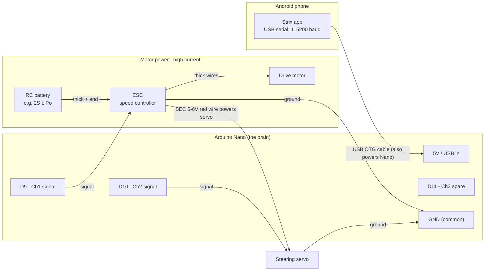

# ESC & Servo Wiring (Direct-Wired)

How to wire a conventional **ESC** and **steering servo** straight to the
Arduino Nano's signal pins. This is the "normal" drive path — it applies when
your ESC has a servo-style signal wire you can plug into the Nano.

> **Sealed receiver+ESC combo?** Waterproof Hosim-style cars pot the receiver
> and ESC into one sealed brick with no input but its own 2.4GHz radio — none
> of the wiring below applies to the drive side. Use
> [`controller-takeover.md`](controller-takeover.md) instead.

New to the parts or the acronyms? Start with the
[hardware wiring overview](hardware-wiring.md) — it explains what each piece
is and the one rule that keeps the Nano alive (signal world vs motor-power
world).

## Which Nano pin does what

This comes straight from `arduino/EscServoController/EscServoController.ino`
and the app's `MotorController.kt`, so it matches the firmware exactly.

| Nano pin | Channel | Wired to | Value range in the app |
| --- | --- | --- | --- |
| **D9** | Channel 1 | **ESC** signal wire (drive) | throttle `-100` (full reverse) … `0` (stop) … `100` (full forward) |
| **D10** | Channel 2 | **Steering servo** signal wire | steering `-100` (full left) … `0` (center) … `100` (full right) |
| **D11** | Channel 3 | Spare / aux (unused by the car) | `-100` … `100` |
| **GND** | — | Common ground for *everything* | — |

The app's `drive(throttle, steering)` helper sends throttle to channel 1 and
steering to channel 2 — so for a basic car you only strictly need **D9**, **D10**,
and **GND** wired up. D11 (channel 3) is an unused spare pin.

## The big picture



Notice there are **two separate power worlds** that only meet at ground:

1. **Logic side (small):** the phone powers the Nano through the USB cable.
2. **Motor side (big):** the RC battery powers the ESC, and the ESC's built-in
   **BEC** (Battery Eliminator Circuit — the 5–6V it puts out on its red servo
   wire) powers the steering servo.

They share **one common ground**. That shared ground is what makes the signal
pulses meaningful to the ESC and servo.

## The ESC and servo connectors explained

Both the ESC and the steering servo end in the same little 3-pin plug. Colors
vary by brand, but the layout is standard:

| Wire | Common colors | What it is |
| --- | --- | --- |
| Signal | white / orange / yellow | The pulse from the Nano (D9 for ESC, D10 for servo) |
| Power (+) | red | 5–6V. On the ESC this is the **BEC output**. |
| Ground (−) | black / brown | Ground — ties into the common ground |

### How to connect them

**ESC (drive) → 3-pin plug:**

- Signal (white/orange) → **D9**
- Ground (black/brown) → **Nano GND**
- Power (red) → **leave disconnected from the Nano** (see the warning below)

**Steering servo → 3-pin plug:**

- Signal (white/orange) → **D10**
- Power (red) → the **ESC's red wire** (let the ESC's BEC power the servo)
- Ground (black/brown) → **common ground**

> ⚠️ **Do NOT connect the ESC's red (BEC) wire to the Nano's 5V pin.** The Nano is
> already powered by the phone over USB. Feeding it a second 5–6V source on the
> same rail makes two power supplies fight each other and can damage the Nano or
> the ESC's regulator. This is called out directly in the firmware comments.
> It's fine — and correct — to use that same BEC red wire to power the *servo*,
> just not the Nano.

## Step-by-step assembly

Do this with the **wheels off the ground** (prop the car on a box) and the
**drive motor unplugged from the ESC** for the very first test, so a bad command
can't launch the car off the bench.

1. **Common ground first.** Connect the ESC's ground wire and the steering
   servo's ground wire to the Nano's **GND**. If you're using a small breadboard
   or a ground rail, run everything's ground to that one rail, then one wire from
   the rail to the Nano GND. Ground is the reference for every signal — get this
   right and half your problems disappear.
2. **ESC signal → D9.** Plug the ESC's signal wire onto Nano pin D9.
3. **Servo signal → D10.** Plug the steering servo's signal wire onto pin D10.
4. **Power the servo from the ESC's BEC.** Connect the servo's red (+) wire to
   the ESC's red (+) wire. Leave that red wire *away* from the Nano's 5V pin.
5. **Battery → ESC (leave motor unplugged for now).** Connect the RC battery to
   the ESC's thick power input wires, matching polarity (+ to +, − to −). This is
   the high-current path — use the fat wires/connectors, never the Nano.
6. **Connect the phone.** Plug the phone into the Nano with a USB OTG cable. The
   phone provides the Nano's power and the serial data link (CH340 chip, 115200
   baud). The app finds the port automatically.

Adding the distance sensors too? Their pins (D2–D5, A4/A5) don't collide with
anything here — wire them per [`sensor-wiring.md`](sensor-wiring.md) whenever
you like.

## First power-on test

The firmware requires you to **arm** the controller before any throttle command
does anything, and it has a **500 ms failsafe** — if it stops hearing commands
for half a second, it forces everything back to neutral. So a crashed app or an
unplugged cable stops the car rather than leaving it running.

With the drive motor still unplugged, use the app (or a serial monitor at 115200
baud) to send:

```
A:1        arm the controller
T2:0       center the steering servo
T2:-100    servo turns full left
T2:100     servo turns full right
T2:0       back to center
A:0        disarm (forces neutral)
```

Watch the steering servo sweep. Once that looks right, **reconnect the drive
motor** and test throttle with the wheels still off the ground:

```
A:1        arm
T1:0       neutral — most ESCs beep here to confirm they're ready
T1:30      30% forward
T1:-30     30% reverse
A:0        disarm
```

If the ESC only beeps and the motor won't spin, it's almost always waiting to see
the **neutral pulse** at startup to finish arming — send `A:1` then `T1:0` and
give it a second. If it spins the wrong way, either flip the two motor wires at
the ESC or invert throttle in software.

## Troubleshooting

| Symptom | Likely cause / fix |
| --- | --- |
| Nothing responds, ESC/servo dead | No common ground. The ESC/servo ground **must** tie to Nano GND. |
| ESC just beeps, motor won't spin | It needs the neutral pulse to arm — send `A:1` then `T1:0`. Some ESCs need throttle calibration; check the ESC manual. |
| App says `ERR:NOT_ARMED` | Send `A:1` first — throttle is ignored until armed. |
| Car twitches then stops after ~0.5s | That's the failsafe. Commands must keep arriving; check the USB cable / app connection. |
| Nano resets or gets hot | You probably connected the ESC's red (BEC) wire to the Nano's 5V. Disconnect it. |
| Motor spins the wrong direction | Swap the two thick motor wires at the ESC, or invert throttle in software. |
| Steering reversed (left is right) | Flip the sign in software, or mount the servo horn the other way. |
| Servo jitters / browns out | Servo isn't getting clean power — power it from the ESC BEC, not the phone's USB rail. |

## Reference

- Hardware overview and doc map: [`hardware-wiring.md`](hardware-wiring.md)
- Distance sensor wiring: [`sensor-wiring.md`](sensor-wiring.md)
- Sealed-ESC alternative: [`controller-takeover.md`](controller-takeover.md)
- Firmware + full pin map: `arduino/EscServoController/EscServoController.ino`
- App-side serial API and protocol: `app/.../MotorController.kt`
- Action → motor mapping (how "TURN_LEFT" becomes throttle+steering): `app/.../DriveCommand.kt`
