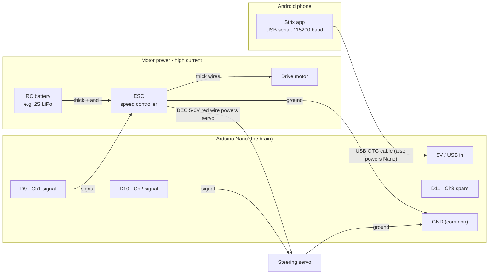
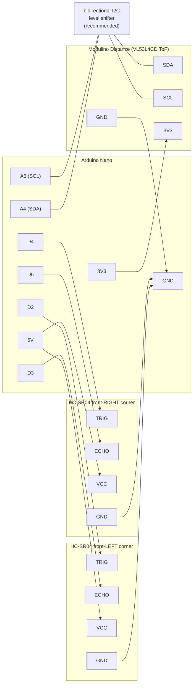

# Hardware Wiring Guide

How to wire the RC car's electronics to the Arduino Nano — written so you can
follow it even if you've never touched an RC car or a microcontroller before.

The car's "brain" is an **Arduino Nano**. The phone runs the Strix app and talks
to the Nano over a USB cable. The Nano then sends signals to the parts that
actually move the car.

## The parts (and their acronyms)

| Part | What it is | Its job |
|---|---|---|
| **Arduino Nano** | A small microcontroller board | Receives commands from the phone, sends signals to everything else |
| **ESC** — *Electronic Speed Controller* | The RC car's motor controller (the acronym you were after) | Takes power from the battery and drives the main **drive motor** forward/reverse based on a signal wire |
| **Steering servo** | A small geared motor that turns the front wheels | Points the wheels left/right |
| **Drive motor** | The big motor that spins the wheels | Makes the car go; it's driven *by the ESC*, never wired to the Nano directly |
| **RC battery** | Usually a 2S LiPo (7.4V) or NiMH pack | Powers the motor side (high current) |

> **Key idea for newbies:** the Nano never touches motor-level power. It only
> sends tiny *signal* pulses. The ESC is the muscle — it takes the fat battery
> wires and does the heavy lifting. Mixing these two worlds up is the #1 way
> people fry a board, so the wiring below keeps them separate.

## Which Nano pin does what

This comes straight from `arduino/MultiChannelController/MultiChannelController.ino`
and the app's `MotorController.kt`, so it matches the firmware exactly.

| Nano pin | Channel | Wired to | Value range in the app |
|---|---|---|---|
| **D9** | Channel 1 | **ESC** signal wire (drive) | throttle `-100` (full reverse) … `0` (stop) … `100` (full forward) |
| **D10** | Channel 2 | **Steering servo** signal wire | steering `-100` (full left) … `0` (center) … `100` (full right) |
| **D11** | Channel 3 | Spare / aux (unused by the car) | `-100` … `100` |
| **GND** | — | Common ground for *everything* | — |

The app's `drive(throttle, steering)` helper sends throttle to channel 1 and
steering to channel 2 — so for a basic car you only strictly need **D9**, **D10**,
and **GND** wired up. D11 (channel 3) is an unused spare pin.

## The big picture



Notice there are **two separate power worlds** that only meet at ground:

1. **Logic side (small):** the phone powers the Nano through the USB cable.
2. **Motor side (big):** the RC battery powers the ESC, and the ESC's built-in
   **BEC** (Battery Eliminator Circuit — the 5–6V it puts out on its red servo
   wire) powers the steering servo.

They share **one common ground**. That shared ground is what makes the signal
pulses meaningful to the ESC and servo.

## The ESC and servo connectors explained

Both the ESC and the steering servo end in the same little 3-pin plug. Colors
vary by brand, but the layout is standard:

| Wire | Common colors | What it is |
|---|---|---|
| Signal | white / orange / yellow | The pulse from the Nano (D9 for ESC, D10 for servo) |
| Power (+) | red | 5–6V. On the ESC this is the **BEC output**. |
| Ground (−) | black / brown | Ground — ties into the common ground |

### How to connect them

**ESC (drive) → 3-pin plug:**

- Signal (white/orange) → **D9**
- Ground (black/brown) → **Nano GND**
- Power (red) → **leave disconnected from the Nano** (see the warning below)

**Steering servo → 3-pin plug:**

- Signal (white/orange) → **D10**
- Power (red) → the **ESC's red wire** (let the ESC's BEC power the servo)
- Ground (black/brown) → **common ground**

> ⚠️ **Do NOT connect the ESC's red (BEC) wire to the Nano's 5V pin.** The Nano is
> already powered by the phone over USB. Feeding it a second 5–6V source on the
> same rail makes two power supplies fight each other and can damage the Nano or
> the ESC's regulator. This is called out directly in the firmware comments.
> It's fine — and correct — to use that same BEC red wire to power the *servo*,
> just not the Nano.

## Step-by-step assembly

Do this with the **wheels off the ground** (prop the car on a box) and the
**drive motor unplugged from the ESC** for the very first test, so a bad command
can't launch the car off the bench.

1. **Common ground first.** Connect the ESC's ground wire and the steering
   servo's ground wire to the Nano's **GND**. If you're using a small breadboard
   or a ground rail, run everything's ground to that one rail, then one wire from
   the rail to the Nano GND. Ground is the reference for every signal — get this
   right and half your problems disappear.
2. **ESC signal → D9.** Plug the ESC's signal wire onto Nano pin D9.
3. **Servo signal → D10.** Plug the steering servo's signal wire onto pin D10.
4. **Power the servo from the ESC's BEC.** Connect the servo's red (+) wire to
   the ESC's red (+) wire. Leave that red wire *away* from the Nano's 5V pin.
5. **Battery → ESC (leave motor unplugged for now).** Connect the RC battery to
   the ESC's thick power input wires, matching polarity (+ to +, − to −). This is
   the high-current path — use the fat wires/connectors, never the Nano.
6. **Connect the phone.** Plug the phone into the Nano with a USB OTG cable. The
   phone provides the Nano's power and the serial data link (CH340 chip, 115200
   baud). The app finds the port automatically.

## Distance sensors: the forward-perception array

The Nano can also report *measured* obstacle distances to the app — true
time-of-flight and ultrasonic readings in absolute millimeters, complementing
the camera's inferred (relative) depth. Three sensors form a **forward
perception array**:

- **Center: Modulino Distance (VL53L4CD time-of-flight).** A narrow (~18°),
  millimeter-accurate laser beam straight ahead, 0–1200mm. This is the
  precision "am I about to hit that?" sensor for the car's driving lane.
- **Front-left + front-right corners: HC-SR04 ultrasonic.** Wide (~15–30°)
  cones, ~20mm–2m. Mounted on the corners and angled slightly outward, they
  cover the flanks the center beam misses — exactly where a clipped doorframe
  or chair leg lives.

Everything looks forward because the mission is deciding **how and when to
advance**. There is deliberately no rear sensor: reversing is only used to
back out along ground the car has already covered.

The three readings line up with the camera's depth bands — left, center,
right — so the measured and inferred views of "what's ahead" speak the same
vocabulary.

### Placement (top-down view)

```
                 obstacle coverage
        \  wide cone   |narrow|   wide cone  /
         \    ~25deg   | ~18deg|   ~25deg   /
          \            |  beam |           /
           \           |       |          /
       [SR04-L]     [ToF center]     [SR04-R]
      angled ~15deg  bumper height  angled ~15deg
      outward   \        |         /   outward
    +------------+-------+--------+------------+
    | front-left |     front      | front-right|   <- front bumper
    +------------+----------------+------------+
    |                                          |
    |            (phone + camera               |
    |             face forward too)            |
    |                 CAR BODY                 |
    |                                          |
    +------------------------------------------+
                (no rear sensors)
```

Mounting guidance:

- **Corner SR04s:** angle each ~10–20° outward from straight ahead. Straight
  ahead wastes them (the ToF already covers that); too far out and they stare
  at walls beside the car. Aim for the cones to *just* overlap the ToF beam a
  car-length ahead.
- **Height:** mount all three at obstacle height — roughly bumper level, high
  enough that flat ground doesn't reflect into the cone. If the SR04s see the
  floor, tilt them up a degree or two.
- **Keep the ToF lens clean and unobstructed** — no body-shell plastic in
  front of it; the laser will happily measure the inside of the shell.

### Wiring diagram



### Pin-by-pin tables

These pins are free in **both** firmware variants (servo/ESC and
controller-takeover), so the same wiring works for either build.

**HC-SR04 corners** — 5V devices, direct to the Nano, no level shifting. Each
has 4 pins in a row, labeled on the board:

| Sensor | Sensor pin | Nano pin | Wire it means |
|---|---|---|---|
| Front-LEFT | VCC | **5V** | power |
| Front-LEFT | Trig | **D2** | "fire a ping" input |
| Front-LEFT | Echo | **D3** | echo-time output |
| Front-LEFT | GND | **GND** | ground |
| Front-RIGHT | VCC | **5V** | power |
| Front-RIGHT | Trig | **D4** | "fire a ping" input |
| Front-RIGHT | Echo | **D5** | echo-time output |
| Front-RIGHT | GND | **GND** | ground |

Left/right is from the **car's own perspective** (driver's seat), not yours
looking at it head-on. If the app's L/R readings ever look swapped, you wired
the sensors to each other's pins — swap D2/D3 with D4/D5.

**Modulino Distance (ToF)** — 3.3V I2C. The Modulino connector is a 4-pin
JST-SH Qwiic socket (pin labels are printed on the board: GND, 3V3, SDA, SCL);
cut a Qwiic cable and crimp/solder to jumper wires, or use the module's
breakout pads:

| Modulino pin | Connects to | Nano pin |
|---|---|---|
| SDA | level shifter LV side ↔ HV side | **A4** |
| SCL | level shifter LV side ↔ HV side | **A5** |
| 3V3 | direct | **3V3** (never 5V) |
| GND | direct | **GND** |

> ⚠️ **The Modulino (Qwiic) ecosystem is 3.3V-only and not 5V tolerant** —
> Arduino's own documentation is explicit about this. Two rules:
>
> 1. Power it from the Nano's **3V3 pin**, never the 5V rail.
> 2. The classic Nano's I2C lines are 5V logic, so put a **bidirectional I2C
>    level shifter** (a ~$2 four-channel BSS138 board: HV side → 5V + A4/A5,
>    LV side → 3V3 + module SDA/SCL, grounds common) between the Nano and the
>    module. A direct connection often works in practice — I2C is open-drain
>    and the module's pull-ups go to 3.3V — but it runs the sensor at the
>    edge of its ratings. The shifter is cheap insurance.

### Assembly order

1. **Grounds first.** All three sensors' GND to the Nano's GND (a ground rail
   on a mini breadboard keeps this tidy). As everywhere in this doc: shared
   ground is what makes every signal meaningful.
2. **Wire the corner SR04s** per the table (VCC→5V, Trig/Echo→D2–D5). Mount
   them on the front corners, angled ~15° outward, at bumper height.
3. **Wire the level shifter**: HV→5V, LV→3V3, GND→GND, HV1/HV2→A4/A5,
   LV1/LV2→module SDA/SCL.
4. **Power the Modulino from 3V3** and mount it front-center at bumper height.
5. **Flash the firmware** (either variant). Building now needs the
   **VL53L4CD** library (Pololu): Arduino IDE → Library Manager → "VL53L4CD",
   or `arduino-cli lib install VL53L4CD`.
6. **Verify over serial** (115200 baud) before trusting the app: send `D?` and
   you should get `D:<center>,<frontLeft>,<frontRight>` in mm, e.g.
   `D:431,822,760`. A `-1` means that sensor has no reading — normal for an
   unwired sensor, out-of-range, or a missed echo. Wave a hand in front of
   each sensor and watch its number move.

### How it behaves

- The firmware samples sensors **round-robin in the background** (one per
  50ms tick), so drive-command latency is unaffected — and the two
  ultrasonics never fire simultaneously, which prevents them hearing each
  other's echoes (cross-talk) despite overlapping cones.
- All sensors are optional: absent ones report `-1` forever and nothing else
  breaks. A missing ToF module is detected at boot and skipped.
- The app polls at ~5Hz while connected, median-filters single-sample
  ultrasonic ghosts/dropouts, and shows "Range · L … · C … · R …" under the
  camera preview — same left-to-right order as the depth-band readout above
  it.

### Sensor troubleshooting

| Symptom | Likely cause / fix |
|---|---|
| A channel always reads `-1` | Sensor unwired/unpowered, Trig/Echo swapped, or (ToF) I2C wiring — check SDA→A4, SCL→A5. |
| L and R appear swapped in the app | Left/right is the car's perspective — swap the D2/D3 and D4/D5 pairs. |
| SR04 reads ~50–150mm constantly in open space | It's seeing the floor or the car's own body — raise it or tilt up slightly. |
| SR04 readings jumpy | Soft/angled surfaces scatter ultrasound; the app's median filter eats single spikes, but persistent jitter means re-aim the sensor. |
| ToF reads a fixed short value | Something is in front of the lens (body shell, tape) — clear line of sight required. |
| ToF absent after boot but wired | It's only probed at power-up — power-cycle the Nano after fixing wiring. |

## First power-on test

The firmware requires you to **arm** the controller before any throttle command
does anything, and it has a **500 ms failsafe** — if it stops hearing commands
for half a second, it forces everything back to neutral. So a crashed app or an
unplugged cable stops the car rather than leaving it running.

With the drive motor still unplugged, use the app (or a serial monitor at 115200
baud) to send:

```
A:1        arm the controller
T2:0       center the steering servo
T2:-100    servo turns full left
T2:100     servo turns full right
T2:0       back to center
A:0        disarm (forces neutral)
```

Watch the steering servo sweep. Once that looks right, **reconnect the drive
motor** and test throttle with the wheels still off the ground:

```
A:1        arm
T1:0       neutral — most ESCs beep here to confirm they're ready
T1:30      30% forward
T1:-30     30% reverse
A:0        disarm
```

If the ESC only beeps and the motor won't spin, it's almost always waiting to see
the **neutral pulse** at startup to finish arming — send `A:1` then `T1:0` and
give it a second. If it spins the wrong way, either flip the two motor wires at
the ESC or invert throttle in software.

## Troubleshooting

| Symptom | Likely cause / fix |
|---|---|
| Nothing responds, ESC/servo dead | No common ground. The ESC/servo ground **must** tie to Nano GND. |
| ESC just beeps, motor won't spin | It needs the neutral pulse to arm — send `A:1` then `T1:0`. Some ESCs need throttle calibration; check the ESC manual. |
| App says `ERR:NOT_ARMED` | Send `A:1` first — throttle is ignored until armed. |
| Car twitches then stops after ~0.5s | That's the failsafe. Commands must keep arriving; check the USB cable / app connection. |
| Nano resets or gets hot | You probably connected the ESC's red (BEC) wire to the Nano's 5V. Disconnect it. |
| Motor spins the wrong direction | Swap the two thick motor wires at the ESC, or invert throttle in software. |
| Steering reversed (left is right) | Flip the sign in software, or mount the servo horn the other way. |
| Servo jitters / browns out | Servo isn't getting clean power — power it from the ESC BEC, not the phone's USB rail. |

## Reference

- Firmware + full pin map: `arduino/MultiChannelController/MultiChannelController.ino`
- App-side serial API and protocol: `app/.../MotorController.kt`
- Action → motor mapping (how "TURN_LEFT" becomes throttle+steering): `app/.../DriveCommand.kt`
