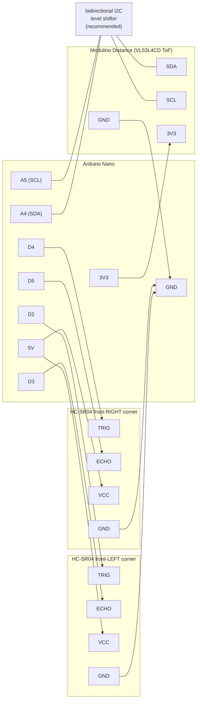

# Sensor Wiring: the Forward-Perception Array

The Nano can report *measured* obstacle distances to the app — true
time-of-flight and ultrasonic readings in absolute millimeters, complementing
the camera's inferred (relative) depth. Three sensors form a **forward
perception array**:

- **Center: Modulino Distance (VL53L4CD time-of-flight).** A narrow (~18°),
  millimeter-accurate laser beam straight ahead, 0–1200mm. This is the
  precision "am I about to hit that?" sensor for the car's driving lane.
- **Front-left + front-right corners: HC-SR04 ultrasonic.** Wide (~15–30°)
  cones, ~20mm–2m. Mounted on the corners and angled slightly outward, they
  cover the flanks the center beam misses — exactly where a clipped doorframe
  or chair leg lives.

Everything looks forward because the mission is deciding **how and when to
advance**. There is deliberately no rear sensor: reversing is only used to
back out along ground the car has already covered.

The three readings line up with the camera's depth bands — left, center,
right — so the measured and inferred views of "what's ahead" speak the same
vocabulary.

This wiring is the same for **both** drive builds — direct-wired ESC
([`esc-wiring.md`](esc-wiring.md)) and controller takeover
([`controller-takeover.md`](controller-takeover.md)) — because the sensor pins
(D2–D5, A4/A5) are free in both firmware variants.

## Placement (top-down view)

```
                 obstacle coverage
        \  wide cone   |narrow|   wide cone  /
         \    ~25deg   | ~18deg|   ~25deg   /
          \            |  beam |           /
           \           |       |          /
       [SR04-L]     [ToF center]     [SR04-R]
      angled ~15deg  bumper height  angled ~15deg
      outward   \        |         /   outward
    +------------+-------+--------+------------+
    | front-left |     front      | front-right|   <- front bumper
    +------------+----------------+------------+
    |                                          |
    |            (phone + camera               |
    |             face forward too)            |
    |                 CAR BODY                 |
    |                                          |
    +------------------------------------------+
                (no rear sensors)
```

Mounting guidance:

- **Corner SR04s:** angle each ~10–20° outward from straight ahead. Straight
  ahead wastes them (the ToF already covers that); too far out and they stare
  at walls beside the car. Aim for the cones to *just* overlap the ToF beam a
  car-length ahead.
- **Height:** mount all three at obstacle height — roughly bumper level, high
  enough that flat ground doesn't reflect into the cone. If the SR04s see the
  floor, tilt them up a degree or two.
- **Keep the ToF lens clean and unobstructed** — no body-shell plastic in
  front of it; the laser will happily measure the inside of the shell.

## Wiring diagram



## Pin-by-pin tables

These pins are free in **both** firmware variants (servo/ESC and
controller-takeover), so the same wiring works for either build.

**HC-SR04 corners** — 5V devices, direct to the Nano, no level shifting. Each
has 4 pins in a row, labeled on the board:

| Sensor | Sensor pin | Nano pin | Wire it means |
| --- | --- | --- | --- |
| Front-LEFT | VCC | **5V** | power |
| Front-LEFT | Trig | **D2** | "fire a ping" input |
| Front-LEFT | Echo | **D3** | echo-time output |
| Front-LEFT | GND | **GND** | ground |
| Front-RIGHT | VCC | **5V** | power |
| Front-RIGHT | Trig | **D4** | "fire a ping" input |
| Front-RIGHT | Echo | **D5** | echo-time output |
| Front-RIGHT | GND | **GND** | ground |

Left/right is from the **car's own perspective** (driver's seat), not yours
looking at it head-on. If the app's L/R readings ever look swapped, you wired
the sensors to each other's pins — swap D2/D3 with D4/D5.

**Modulino Distance (ToF)** — 3.3V I2C. The Modulino connector is a 4-pin
JST-SH Qwiic socket (pin labels are printed on the board: GND, 3V3, SDA, SCL);
cut a Qwiic cable and crimp/solder to jumper wires, or use the module's
breakout pads:

| Modulino pin | Connects to | Nano pin |
| --- | --- | --- |
| SDA | level shifter LV side ↔ HV side | **A4** |
| SCL | level shifter LV side ↔ HV side | **A5** |
| 3V3 | direct | **3V3** (never 5V) |
| GND | direct | **GND** |

> ⚠️ **The Modulino (Qwiic) ecosystem is 3.3V-only and not 5V tolerant** —
> Arduino's own documentation is explicit about this. Two rules:
>
> 1. Power it from the Nano's **3V3 pin**, never the 5V rail.
> 2. The classic Nano's I2C lines are 5V logic, so put a **bidirectional I2C
>    level shifter** (a ~$2 four-channel BSS138 board: HV side → 5V + A4/A5,
>    LV side → 3V3 + module SDA/SCL, grounds common) between the Nano and the
>    module. A direct connection often works in practice — I2C is open-drain
>    and the module's pull-ups go to 3.3V — but it runs the sensor at the
>    edge of its ratings. The shifter is cheap insurance.

## Assembly order

1. **Grounds first.** All three sensors' GND to the Nano's GND (a ground rail
   on a mini breadboard keeps this tidy). As everywhere in these docs: shared
   ground is what makes every signal meaningful.
2. **Wire the corner SR04s** per the table (VCC→5V, Trig/Echo→D2–D5). Mount
   them on the front corners, angled ~15° outward, at bumper height.
3. **Wire the level shifter**: HV→5V, LV→3V3, GND→GND, HV1/HV2→A4/A5,
   LV1/LV2→module SDA/SCL.
4. **Power the Modulino from 3V3** and mount it front-center at bumper height.
5. **Flash the firmware** (either variant). Building now needs the
   **VL53L4CD** library (Pololu): Arduino IDE → Library Manager → "VL53L4CD",
   or `arduino-cli lib install VL53L4CD`.
6. **Verify over serial** (115200 baud) before trusting the app: send `D?` and
   you should get `D:<center>,<frontLeft>,<frontRight>` in mm, e.g.
   `D:431,822,760`. A `-1` means that sensor has no reading — normal for an
   unwired sensor, out-of-range, or a missed echo. Wave a hand in front of
   each sensor and watch its number move.

## How it behaves

- The firmware samples sensors **round-robin in the background** (one per
  50ms tick), so drive-command latency is unaffected — and the two
  ultrasonics never fire simultaneously, which prevents them hearing each
  other's echoes (cross-talk) despite overlapping cones.
- All sensors are optional: absent ones report `-1` forever and nothing else
  breaks. A missing ToF module is detected at boot and skipped.
- The app polls at ~5Hz while connected, median-filters single-sample
  ultrasonic ghosts/dropouts, and shows "Range · L … · C … · R …" under the
  camera preview — same left-to-right order as the depth-band readout above
  it.

## Sensor troubleshooting

| Symptom | Likely cause / fix |
| --- | --- |
| A channel always reads `-1` | Sensor unwired/unpowered, Trig/Echo swapped, or (ToF) I2C wiring — check SDA→A4, SCL→A5. |
| L and R appear swapped in the app | Left/right is the car's perspective — swap the D2/D3 and D4/D5 pairs. |
| SR04 reads ~50–150mm constantly in open space | It's seeing the floor or the car's own body — raise it or tilt up slightly. |
| SR04 readings jumpy | Soft/angled surfaces scatter ultrasound; the app's median filter eats single spikes, but persistent jitter means re-aim the sensor. |
| ToF reads a fixed short value | Something is in front of the lens (body shell, tape) — clear line of sight required. |
| ToF absent after boot but wired | It's only probed at power-up — power-cycle the Nano after fixing wiring. |

## Reference

- Hardware overview and doc map: [`hardware-wiring.md`](hardware-wiring.md)
- Firmware (either variant reads the sensors): `arduino/EscServoController/EscServoController.ino`, `arduino/ControllerTakeover/ControllerTakeover.ino`
- App-side polling and display: `app/.../MotorController.kt`, `app/.../DistanceReport.kt`
